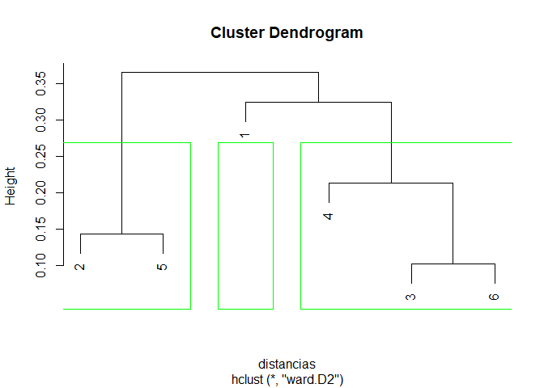

Cluster
================

### setwd(“\~/AMV-21/2nd\_Parcial”)

## Construir los vectores

``` r
x <- c(0.4,0.22,0.35,0.26,0.08,0.45)
y <- c(0.53,0.38,0.32,0.19,0.41,0.30)

datos <- data.frame(x,y)
```

## Calculo de Dist Euclidianas

``` r
(distancias <- dist(datos))
```

              1         2         3         4         5
    2 0.2343075                                        
    3 0.2158703 0.1431782                              
    4 0.3676955 0.1941649 0.1581139                    
    5 0.3417601 0.1431782 0.2846050 0.2842534          
    6 0.2353720 0.2435159 0.1019804 0.2195450 0.3860052

``` r
(dendograma <- hclust(distancias, "ward.D2") )
```


    Call:
    hclust(d = distancias, method = "ward.D2")

    Cluster method   : ward.D2 
    Distance         : euclidean 
    Number of objects: 6 

## Greafica del Dendograma

``` r
plot(dendograma)
rect.hclust(dendograma, k=3, border = "green")
```

<!-- -->

## TAREA

``` r
data("iris")
View(iris)
flores <- iris
```
