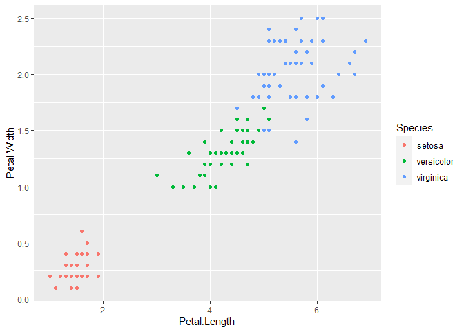
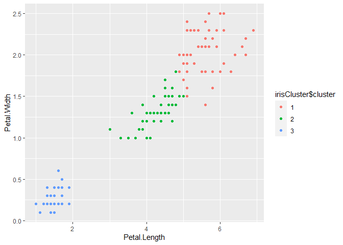

IRIS CLUSTER
================

# import data set

``` r
library(datasets)

# it will display heading of the data wtih initial rows 
head(iris,3)
```

      Sepal.Length Sepal.Width Petal.Length Petal.Width Species
    1          5.1         3.5          1.4         0.2  setosa
    2          4.9         3.0          1.4         0.2  setosa
    3          4.7         3.2          1.3         0.2  setosa

``` r
names(iris)
```

    [1] "Sepal.Length" "Sepal.Width"  "Petal.Length" "Petal.Width"  "Species"     

## Calculo de los clusters by Kmeans

``` r
library(ggplot2)

ggplot(iris, aes(Petal.Length, Petal.Width, color = Species)) + geom_point()
```

<!-- -->

``` r
# set the point on initial seed
set.seed(15)

# create k-Means Cluster for iris data set
irisCluster <- kmeans(iris[,3:4], 3, nstart = 15)


irisCluster
```

    K-means clustering with 3 clusters of sizes 48, 52, 50

    Cluster means:
      Petal.Length Petal.Width
    1     5.595833    2.037500
    2     4.269231    1.342308
    3     1.462000    0.246000

    Clustering vector:
      [1] 3 3 3 3 3 3 3 3 3 3 3 3 3 3 3 3 3 3 3 3 3 3 3 3 3 3 3 3 3 3 3 3 3 3 3 3 3
     [38] 3 3 3 3 3 3 3 3 3 3 3 3 3 2 2 2 2 2 2 2 2 2 2 2 2 2 2 2 2 2 2 2 2 2 2 2 2
     [75] 2 2 2 1 2 2 2 2 2 1 2 2 2 2 2 2 2 2 2 2 2 2 2 2 2 2 1 1 1 1 1 1 2 1 1 1 1
    [112] 1 1 1 1 1 1 1 1 2 1 1 1 1 1 1 2 1 1 1 1 1 1 1 1 1 1 1 2 1 1 1 1 1 1 1 1 1
    [149] 1 1

    Within cluster sum of squares by cluster:
    [1] 16.29167 13.05769  2.02200
     (between_SS / total_SS =  94.3 %)

    Available components:

    [1] "cluster"      "centers"      "totss"        "withinss"     "tot.withinss"
    [6] "betweenss"    "size"         "iter"         "ifault"      

# Tabla con los clusters calculados

``` r
table(irisCluster$cluster, iris$Species)
```

       
        setosa versicolor virginica
      1      0          2        46
      2      0         48         4
      3     50          0         0

## Nuevo plot con los clusters calculados

``` r
irisCluster$cluster <- as.factor(irisCluster$cluster)

# plot cluster using K-Means model

ggplot(iris, aes(Petal.Length, Petal.Width, color = 
                   irisCluster$cluster)) +
      geom_point()
```

<!-- -->
